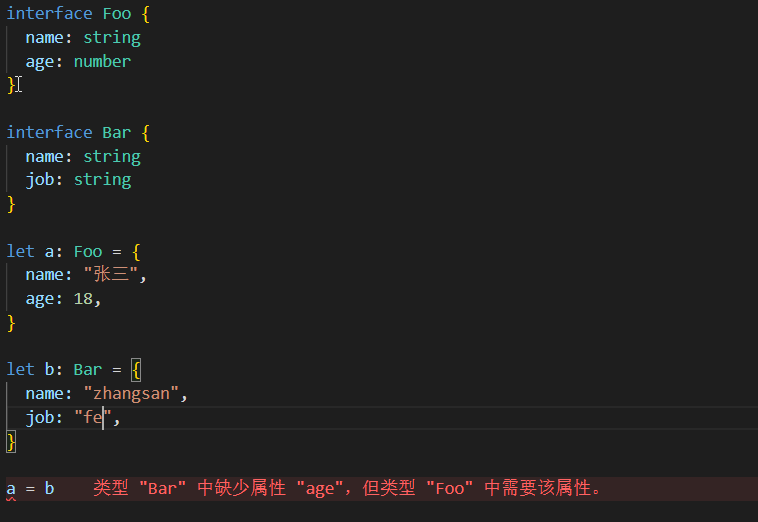
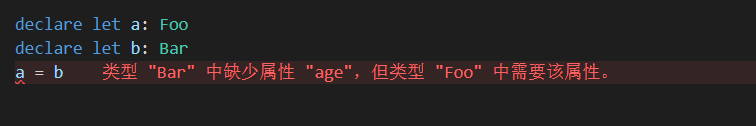

# TypeScript总结

## 一、配置typescript开发环境

1、全局安装

```
npm i ts-node typescript -g
```

2、创建配置文件

```
tsc --init
```

3、执行文件

```
ts-node index.ts
```

4、动态监听nodemon

```
npm i ts-node-dev -g
```

```
ts-node-dev --respawn --transpile-only app.ts
```

```
tsdn --respawn --transpile-only app.ts
```

5、方便的类型兼容性检查





6、使用tsd工具性进行类型检查

- `expectType<你预期的类型>(表达式或变量等)` 检查预期类型与表达式或变量的类型是否一致
- `expectNotType`（检查预期类型与表达式或变量的类型是否不同）
- `expectAssignable`（检查表达式或变量的类型是否能赋值给预期类型）

7、declare

类型声明